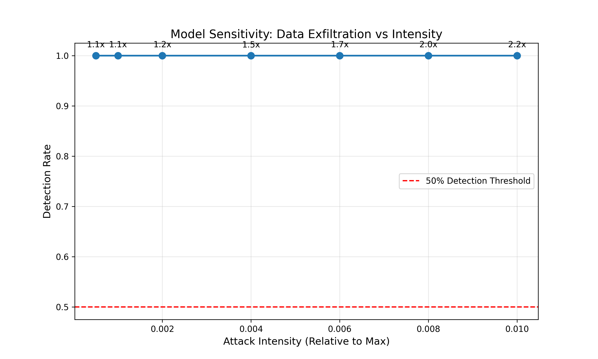

# Sensitivity Analysis Report

Determining the detection limits of the Isolation Forest model.

| Intensity | Avg Multiplier | Detection Rate |
|-----------|----------------|----------------|
| 0.01 | 2.2x | 100.0% |
| 0.01 | 2.0x | 100.0% |
| 0.01 | 1.7x | 100.0% |
| 0.00 | 1.5x | 100.0% |
| 0.00 | 1.2x | 100.0% |
| 0.00 | 1.1x | 100.0% |
| 0.00 | 1.1x | 100.0% |

